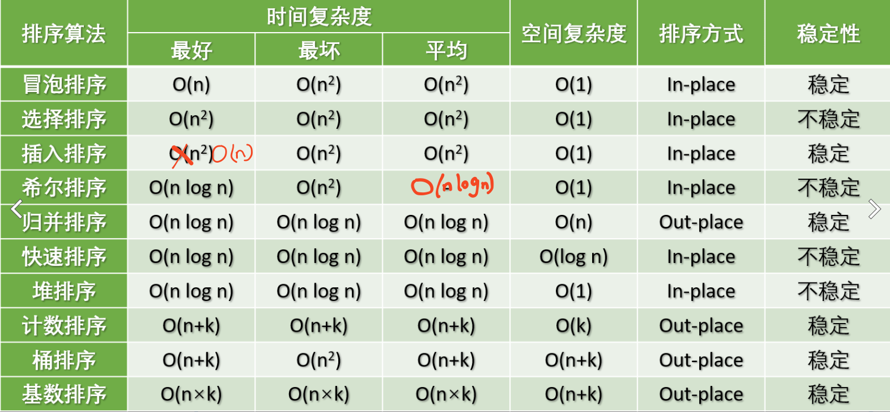

# 十大排序算法
- 稳定：如果 A 原本在 B 前面，而 A=B，排序之后 A 仍然在 B 的前面。
- 不稳定：如果 A 原本在 B 的前面，而 A=B，排序之后 A 可能会出现在 B 的后面。
- 内排序：所有排序操作都在内存中完成。
- 外排序：由于数据太大，因此把数据放在磁盘中，而排序通过磁盘和内存的数据传输才能进行。

分为两大类:
1. 比较类排序:
2. 非比较类排序:
## 1. 冒泡排序 Bubble Sort

## 2. 选择排序 Selection Sort

## 3. 插入排序 Insertion Sort

## 4. 希尔排序 Shell Sort

## 5. 归并排序 Merge Sort

## 6. 快速排序 Quick Sort

## 7. 堆排序 Heap Sort

## 8. 计数排序 Counting Sort

## 9. 桶排序 Bucket Sort

## 10. 基数排序 Radix Sort